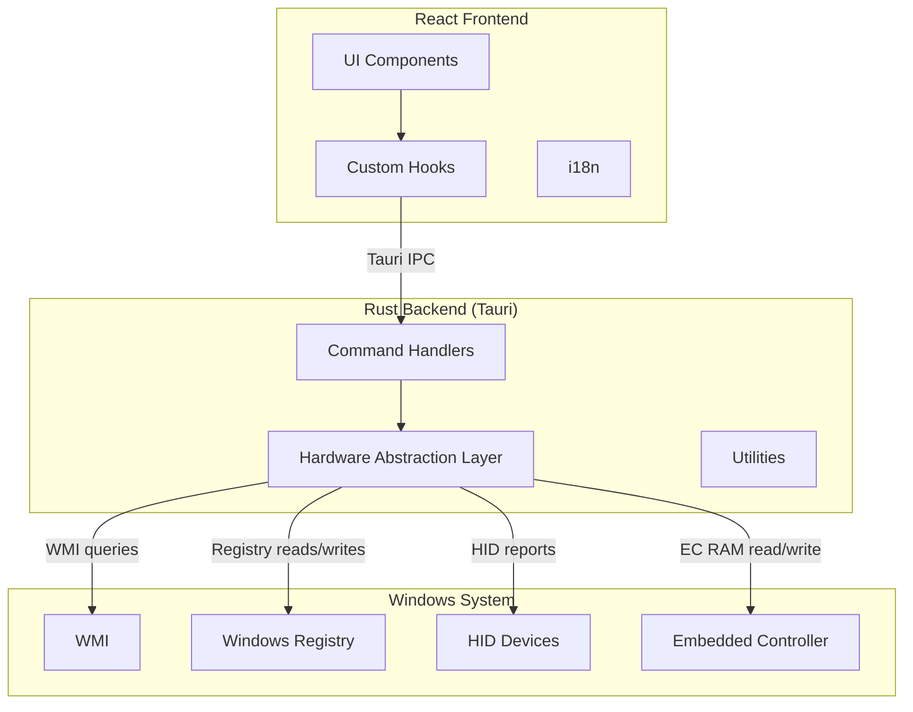

# miPC Architecture

## Overview

miPC is a Windows desktop application built with Tauri v2, React 19, and Rust. It provides hardware control and monitoring for Xiaomi laptop hardware.

## Technology Stack

| Layer    | Technology                 |
| -------- | -------------------------- |
| Frontend | React 19, TypeScript, Vite |
| Backend  | Rust, Tauri v2             |
| Platform | Windows 10/11              |
| Build    | npm, Cargo                 |

## Architecture Diagram

## Hardware Abstraction Layer (HAL)

The HAL is the core of the backend. Each hardware module in `src-tauri/src/hw/` encapsulates access to a specific hardware subsystem:

| Module           | Responsibility                                     |
| ---------------- | -------------------------------------------------- |
| `audio.rs`       | Audio device enumeration and volume control        |
| `battery.rs`     | Battery level, health, charge/discharge rates      |
| `charging.rs`    | Charging threshold limits                          |
| `discovery.rs`   | Hardware discovery and profiling                   |
| `display.rs`     | Display brightness, refresh rate, HDR              |
| `ecram.rs`       | Embedded Controller RAM access                     |
| `fan.rs`         | Fan speed and mode control                         |
| `hotkeys.rs`     | Keyboard hotkey detection and remapping            |
| `iotservice.rs`  | IoT service pipe communication with driver         |
| `mic.rs`         | Microphone status                                  |
| `osd.rs`         | On-screen display notifications                    |
| `performance.rs` | Performance mode switching (WMI/VHF)               |
| `processes.rs`   | Process listing and management                     |
| `screen_cast.rs` | Miracast device discovery and casting              |
| `startup.rs`     | App auto-start configuration                       |
| `system_info.rs` | System information queries                         |
| `touchpad.rs`    | Touchpad haptics, sensitivity, gestures            |
| `update.rs`      | Update status checks                               |
| `wifi.rs`        | WiFi scanning, connection, status via `netsh wlan` |
| `wmi_cache.rs`   | Cached WMI session for reuse                       |

## Adding a New Hardware Feature

See [Adding a Hardware Feature](./adding-a-hardware-feature.md) for a step-by-step guide.

## Security Model

- **HMAC-signed elevated bridge** for privileged operations
- **Consent-gated telemetry** with audit logging
- **API keys stored in OS keyring** (never exposed to frontend)
- **CSP-compliant** frontend (no unsafe-inline)
- **ECRAM write guard-rails** with allowlist and env-gated raw writes

## Data Flow

1. User interacts with React UI
2. Hook calls Tauri command via `invoke()`
3. Command handler processes request
4. HAL module accesses hardware via WMI/Registry/HID/EC
5. Result returned through Tauri IPC
6. Hook updates React state
7. UI re-renders
