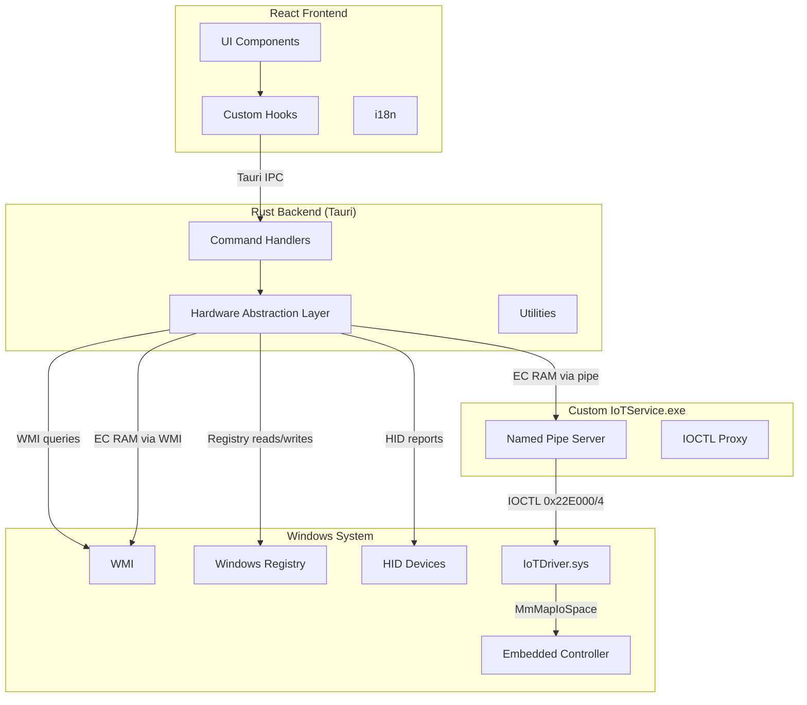

# miPC Architecture

## Overview

miPC is a Windows desktop application built with Tauri v2, React 19, and Rust. It provides hardware control and monitoring for Xiaomi laptop hardware.

## Technology Stack

| Layer    | Technology                 |
| -------- | -------------------------- |
| Frontend | React 19, TypeScript, Vite |
| Backend  | Rust, Tauri v2             |
| Platform | Windows 10/11              |
| Build    | npm, Cargo                 |

## Architecture Diagram

## Hardware Abstraction Layer (HAL)

The HAL is the core of the backend. Each hardware module in `src-tauri/src/hw/` encapsulates access to a specific hardware subsystem:

| Module           | Responsibility                                                                 |
| ---------------- | ------------------------------------------------------------------------------ |
| `audio.rs`       | Audio device enumeration and volume control                                    |
| `battery.rs`     | Battery level, health, charge/discharge rates                                  |
| `charging.rs`    | Charging threshold limits                                                      |
| `discovery.rs`   | Hardware discovery and profiling                                               |
| `display.rs`     | Display brightness, refresh rate, HDR                                          |
| `ecram.rs`       | Embedded Controller RAM access (IOCTL + pipe client for custom IoTService.exe) |
| `fan.rs`         | Fan speed and mode control (WMI MICommonInterface)                             |
| `hotkeys.rs`     | Keyboard hotkey detection and remapping                                        |
| `iotservice.rs`  | IoT service pipe communication with driver                                     |
| `wmi_ec.rs`      | WMI-based EC read/write (MICommonInterface, root\WMI)                          |
| `mic.rs`         | Microphone status                                                              |
| `osd.rs`         | On-screen display notifications                                                |
| `performance.rs` | Performance mode switching (WMI/VHF)                                           |
| `processes.rs`   | Process listing and management                                                 |
| `screen_cast.rs` | Miracast device discovery and casting                                          |
| `startup.rs`     | App auto-start configuration                                                   |
| `system_info.rs` | System information queries                                                     |
| `touchpad.rs`    | Touchpad haptics, sensitivity, gestures                                        |
| `update.rs`      | Update status checks                                                           |
| `wifi.rs`        | WiFi scanning, connection, status via `netsh wlan`                             |
| `wmi_cache.rs`   | Cached WMI session for reuse                                                   |

## EC RAM Access Architecture

MiControl accesses the Embedded Controller (EC) RAM through two paths:

### 1. WMI Path (no driver required)

Most hardware features work via WMI (`MICommonInterface` in `root\WMI`):

- Performance mode (ACPI WMAA method)
- Battery health and charge thresholds
- Fan speed monitoring
- AC adapter power status

This path only requires admin privileges — no process name check.

### 2. IoTDriver.sys Path (requires custom IoTService.exe)

Direct EC RAM access via IOCTLs (`0x22E000` READ, `0x22E004` WRITE) requires:

- Process named `IoTService.exe`
- Located in the DriverStore directory
- Only 3 hardcoded physical address ranges are accessible

A custom replacement binary (`src-tauri/src/bin/ecram_service.rs`) was built to satisfy these requirements. It provides:

- Named pipe IPC server at `\\.\pipe\ecram_service` (JSON protocol)
- ECRAM read/write proxy to IoTDriver.sys
- CLI mode for testing
- Windows service mode for production

MiControl's `ecram.rs` module includes a pipe client (`read_ecram_via_pipe()`) that communicates with this service.

**Limitation**: ERAM (`0xFE0B0300`) and SMA2 (`0xFE0B0A00`) regions are NOT accessible — the driver's hardcoded address ranges do not include them. See [RE_ANALYSIS_REPORT.md](./RE_ANALYSIS_REPORT.md) for details.

## Adding a New Hardware Feature

See [Adding a Hardware Feature](./adding-a-hardware-feature.md) for a step-by-step guide.

## Security Model

- **HMAC-signed elevated bridge** for privileged operations
- **Consent-gated telemetry** with audit logging
- **API keys stored in OS keyring** (never exposed to frontend)
- **CSP-compliant** frontend (no unsafe-inline)
- **ECRAM write guard-rails** with allowlist and env-gated raw writes

## Data Flow

1. User interacts with React UI
2. Hook calls Tauri command via `invoke()`
3. Command handler processes request
4. HAL module accesses hardware via:
   - **WMI** — Performance mode, battery, fan, adapter power
   - **Registry** — App settings, startup config
   - **HID** — Keyboard, touchpad
   - **EC RAM (via pipe)** — IOT_STATUS, IOT_SENSORS, ECRAM sensor block (through custom IoTService.exe)
   - **EC RAM (via WMI)** — EC read/write via MICommonInterface
5. Result returned through Tauri IPC
6. Hook updates React state
7. UI re-renders
